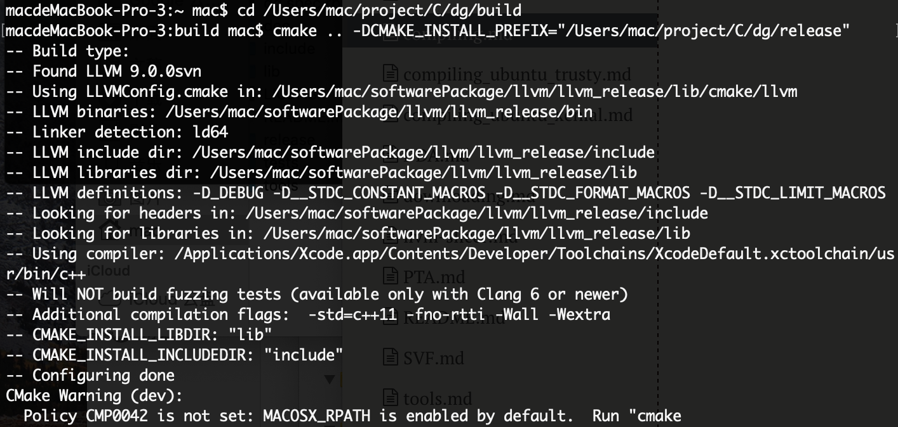
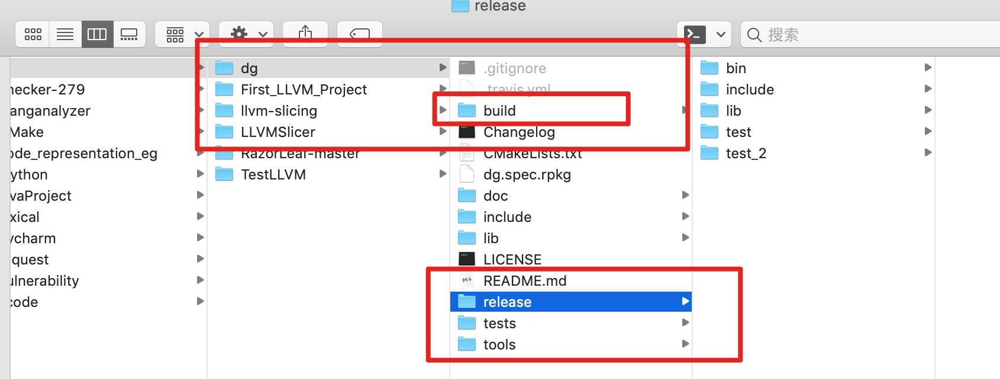
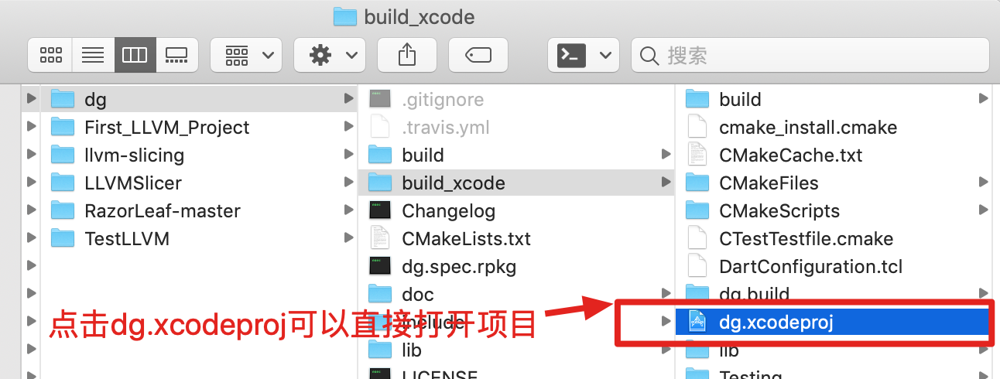
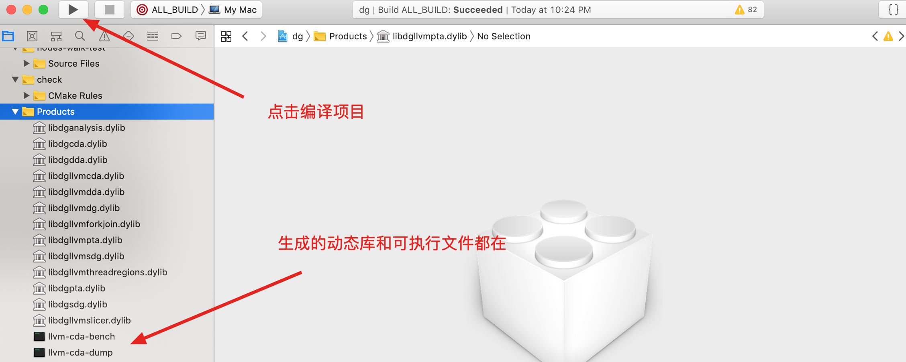
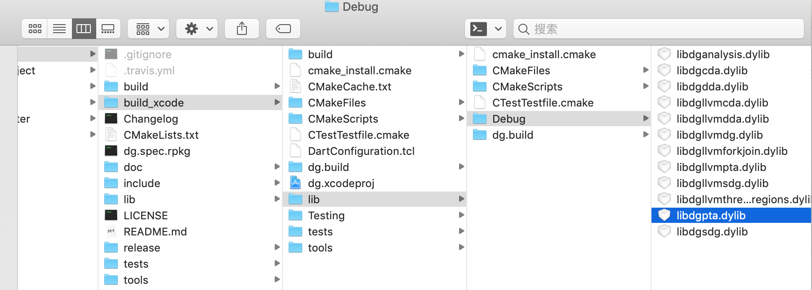
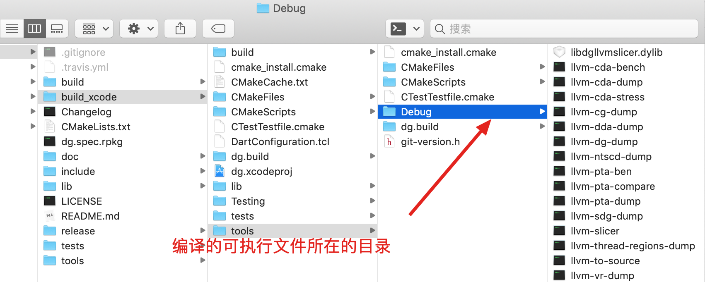

# Compiling DG from sources

## CMake & Make & Make install

### Requirements

DG needs LLVM 3.4 or higher. Further   are `cmake`, `make`, `g++` or `clang++`
in a version that supports at least C++11 standard.
And, of course, `git` for downloading the project. On some systems,
also `zlib` is required. For compilation of files into LLVM, we need also `clang`
compiler. To run slicing tests and some of the tools, you need also an installation
of `python`.

On Ubuntu, you install the dependencies with:

```
apt install git cmake make llvm zlib1g-dev clang g++ python3
```

On ArchLinux, the command for installing the dependencies is the following:

```
pacman -S git cmake make llvm clang gcc python
```

On CentOS/RHEL/Fedora, the command for installing the dependencies is the following:

```
dnf install git cmake make zlib-devel llvm-devel llvm-static gcc-c++ ncurses-devel
```

You can use also LLVM compiled from sources (see below).

### Compiling DG

The first step is to clone the repository to your machine:

```
git clone https://github.com/mchalupa/dg
cd dg
```

Once you have the project cloned, you need to configure it.
When LLVM is installed on your system in standard paths,
the configuration should be as easy as calling `cmake`:

```
cmake .
```
or (我电脑上的执行命令)
```
mkdir build
cd build
cmake .. -DCMAKE_INSTALL_PREFIX="/Users/mac/project/C/dg/release" 
```

> -DCMAKE_INSTALL_PREFIX 要是绝对路径，不能是相对路径



关于Cmake的解释可查看gitbook文档CMake_program_slicing_dg.md




However, if you have LLVM installed in non-standard paths, or you have several
versions of LLVM and want to use a particular one, you must manually specify
path to the installation:

```
cmake -DLLVM_SRC_PATH=/path/to/src -DLLVM_BUILD_PATH=/path/to/build -DLLVM_DIR=path/to/llvm/share/llvm/cmake .
```

LLVM\_DIR is an environment variable used by LLVM to find cmake config files
(it points to the build or install directory), LLVM\_SRC\_DIR is a variable
that tells cmake where to look for llvm's sources and it is used to override
include paths. The same holds for LLVM\_BUILD\_PATH that is used to override
library paths. Usually, you don't need to specify all these variables:
LLVM\_DIR variable is useful if there is any collision (i.e. there are more
versions of LLVM installed) and you want to use a particular build of LLVM. In
that case, define the LLVM\_DIR variable to point to the directory where are
the config files of the desired version (`$PREFIX/share/llvm/cmake` or
`$PREFIX/lib/cmake/llvm/` for newer versions of LLVM -- for system
installations, `PREFIX` is usually set to `/usr`).  If you have LLVM compiled
from sources but not installed anywhere, you may need to use LLVM\_SRC\_PATH
and LLVM\_BUILD\_PATH variables to specify the directory with sources and
build.  As an example, suppose you have LLVM built in /home/user/llvm-build
from sources in /home/user/llvm-src. Then the following configuration should
work:

```
cmake -DLLVM_SRC_PATH=/home/user/llvm-src -DLLVM_BUILD_PATH=/home/user/llvm-build -DLLVM_DIR=/home/user/llvm-build/share/llvm/cmake .
```

If you want to build the project with debugging information and assertions, you
may specify the build type by adding `-DCMAKE_BUILD_TYPE=Debug` during
configuration. Also, you may enable building with sanitizers by adding
`-DUSE_SANITIZERS`.

After configuring the project, usual `make` takes place:

```
make -j4
```

> j4代表使用4个内核

In this documentation, you can find also some reports of how we compiled DG on
different Linux systems with the system LLVM packages. These documents describe
just the one-time experience and are not maintained. Therefore,
the reports may be out-of-date:

- [Compiling on Ubuntu Trusty](compiling_ubuntu_trusty.md)
- [Compiling on Ubuntu Xenial](compiling_ubuntu_xenial.md)


## XCode编译

### 建立文件夹build_xcode


### 执行构建命令

```
cmake -G Xcode ..
```

> ..是源文件所在的文件夹，即上层目录
>
> -G Xcode 是生成xcode 模板


### 打开项目



### 编译项目



### 编译成功


编译的动态库所在的目录



编译的可执行文件所在的目录



## Building with SVF support

If you want to build DG with the support of the
[SVF](https://github.com/SVF-tools/SVF) library, you must specify `SVF_DIR`
variable to point to the build of SVF. For more information, see [documentation
for SVF](SVF.md).

## Testing

You can run tests with `make check`. The command runs unit tests and also tests of slicing LLVM bitcode
in several different configurations, so it may take a while. If the project is configured with `TESTING_ENABLE_FUZZING`
cmake variable, also tests using libFuzzer are compiled and run.
